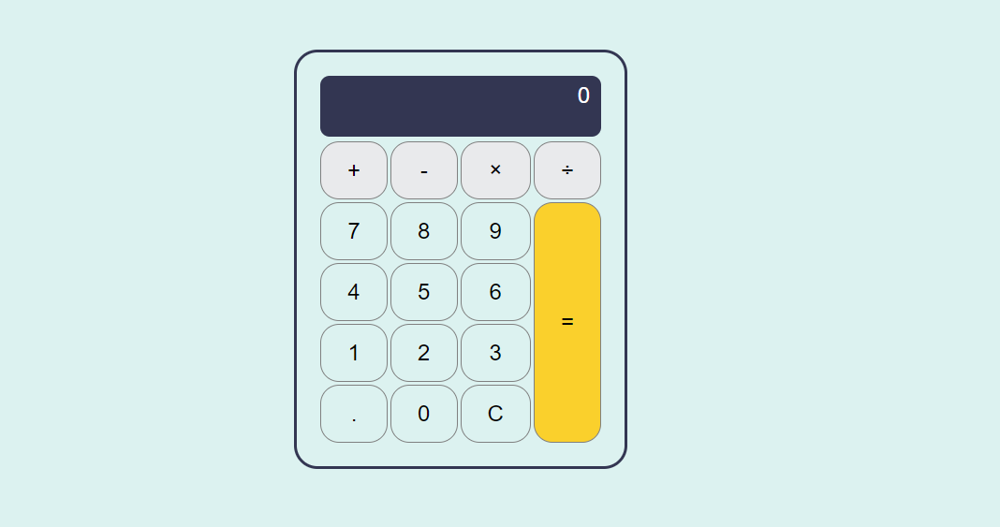

# Calculator - JS

A calculator who perform simple calculations and has a clean design, this project allowed me practice javascript and improve logical thinking.

### Screenshot

### Links

https://reginaguermandi.github.io/calculator/

## My Process

I watch some tutorials, research things I don't know about yet, take notes on how and when to use it.
Then I make a step by step of the entire project without much details, this help me a think more in how to solve the problem, consecutively improve my search skill.

### Built with

- semantic HTML
- CSS custom properties
- Flexbox
- CSS Grid
- Vanilla JavaScript

### What I learn

- introduce BEM pattern
- work with data attributes 
- parseInt(), parseFloat(), closest(), includes()

### Continued development

- BEM pattern
- code refactoring and destructuring 
- improve logical thinking

### Useful resources

- [BEM pattern](http://getbem.com/introduction/)
- [Data attributes](https://developer.mozilla.org/pt-BR/docs/Learn/HTML/Howto/Use_data_attributes)
- [Kevin Powell/Zell Liew stream](https://www.youtube.com/watch?v=f0SG2j6d-Kg&t=3057s&ab_channel=KevinPowell)
